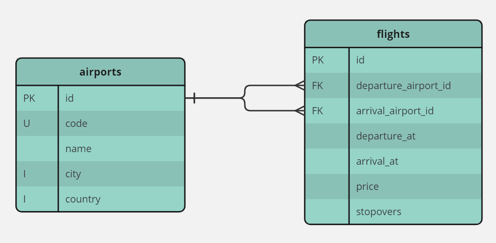

    <h1 align="center">AIRLINE BACKEND</h1>
    <h3 align="center">Scalable backend API coding challenge</h3>

 

This repository contains the implementation of a scalable backend API for a fictional airline company. The project focuses on defining CRUD endpoints for airports and flights, supporting pagination, sorting, and filtering, and implementing a secure authentication mechanism.

 

## Requirments
- PHP 8.1
- Composer
- Docker

 

## Technology Stack

#### Laravel
Scalability advantages, robust Eloquent ORM, easy syntax and strong community support.

#### Docker
Uniform development environments to enhance scalability.

#### Laravel Sail
Reduced setup complexity.

#### MySQL
Simplicity, no need for particular features.

#### Laravel Sanctum
Lightweight authentication, development ease. I opted for the bearer token solution.

#### Pest
Simplicity, readability, and seamless Laravel integration.

 

## API Design
I chose a RESTful API for its simplicity and scalability, providing a standardized and versatile solution. Its stateless nature makes it very reliable.
I used API versioning, followed naming conventions for endpoints and employed custom request classes for validation, maintaining a clear separation of concerns. Additionally, I implemented pagination, multi-column sorting, and a wide range of filters, especially for the Flight model.

 

## Possible Improvements
Considerable improvements can be made to enhance system performance and reliability. Implementing caching mechanisms, employing load balancing strategies, and expanding the test coverage with more extensive unit/integration tests will optimize response times, resource utilization, and overall system robustness.

 

## Database

  

 

## Setup Instructions

Copy the repository:
~~~
git clone https://github.com/Glabdugrib/airline-backend.git
~~~
 

Inside the repository's root:
~~~
composer install
~~~
 

Copy the `.env.example` file in the root of the repository and rename it to `.env`.
  

Generate a new application key:
~~~
php artisan key:generate
~~~
 

Create the Docker containers with Laravel Sail (use a WSL2 terminal if you are using Windows):
~~~
./vendor/bin/sail up -d
~~~
 

Open Docker's shell:
~~~
./vendor/bin/sail shell
~~~
 

Run the migrations and the seeders for local and testing enverinments:
~~~
php artisan migrate:fresh —seed
php artisan migrate:fresh --env=testing
~~~
 

To run the unit & integration tests:
~~~
php artisan test
~~~
 

Procede to this link to try the APIs:
 
[Swagger API documentation](https://glabdugrib.github.io/airline-swagger)
  

Login in the `/login` enpoint with these credentials:
~~~
test@example.com
password
~~~
 

Copy the `access_token` and paste it in the Authorize button at the top-right side of the Swagger page.
  

Now everything is ready!
  

To close Docker's shell:
~~~
exit
~~~
 

To stop Docker's shell (and Laravel Sail):
~~~
./vendor/bin/sail down
~~~
 
